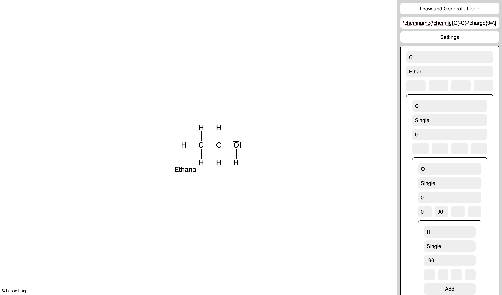

# Chemfig visual editor

This is an web-tool to easily create chemical structures and the corresponding code for the LaTeX chemfig package.

[Try it here](https://lasse-tom-lang.github.io/chemfig-visual-editor/)

